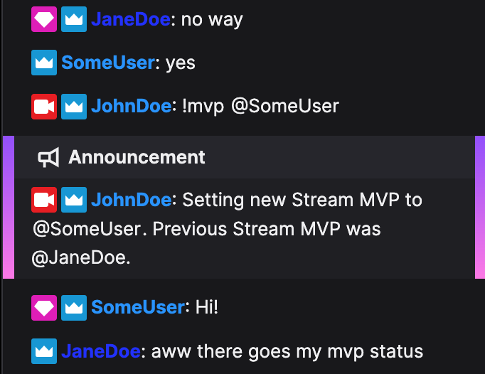
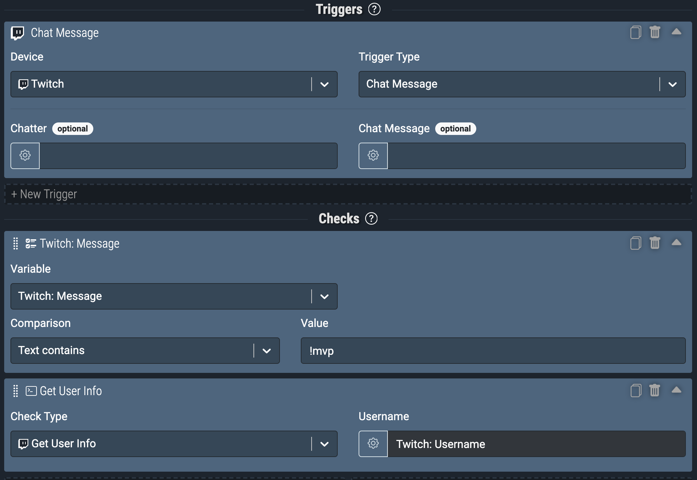
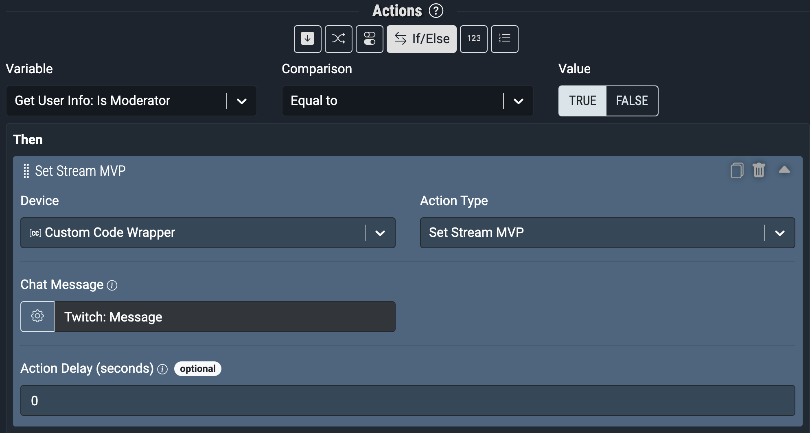

# Aitum for iSV

## To non-developers / users looking to learn

The following parts will require an IDE (dev-speak for a text editor) for you to have an easy time.

We recommend using [Visual Studio Code](https://code.visualstudio.com/) as it's a free and decent IDE to get started with.

If you want to take the time and understand the tooling that is commonly used in the dev world, take a look at [Facehair4000's Beginner's Guide to Software Engineering and Web Development](https://www.youtube.com/watch?v=Wt47gSihb5s&list=PLJjxqjPti-LfbLhTs-XSNecyqBOtRB0fS), which is an excellent series to get you started.

## Installation

Make sure you have NodeJS installed on your computer, which you can install from [here](https://nodejs.org/en/).

Clone or download (via the green button near the top right of this page > Download ZIP) this repository into a suitable place on your computer.

Open the folder up in your IDE.

Open up an integrated terminal or equivalent and install the dependencies:

```
npm i
```

After installing dependencies, run the following to generate your `settings.env` file.

```
npm run setup
```

This creates a `settings.env` file at the root directory of the project.

Edit your `settings.env` to customise the name you want for this CC instance and to include your APIKey from within Aitum.
The API Key can be found from within Settings > Aitum Settings > API Key.

## Getting started

Now that you're all set up, let's get the environment running.

Just to ensure you've got the latest versions of aitum.js and the CC lib, run:

```
npm run upgrade
```

The CC environment is build with rapid iteration in mind and thus we've chosen to **always hot reload** on code changes.

To run the wrapper:

```
npm run start
```

The wrapper will automatically find the Aitum master on your network and attempt to connect.
If there are any issues connecting, they will be logged to your terminal.

## Custom Actions

### [Set Stream MVP](src/actions/SetStreamMVP.ts)

Moderator-only `!mvp <username>` command to set a specific chatter as the Stream MVP, which grants them the VIP status and stores their username in a global variable for use by other rules. Optionally, when the command is issued, specified Elgato lights can be flashed off and on (500ms delay).



#### Setup

Create a global variable named `CurrentStreamMVP` with a default string value. This will be overwritten by this custom action.

Configure a rule in Aitum as shown:





_Note that the Device name may differ for you depending on what you specify in your `settings.env` file_

#### Configuration

| Variable                                | Description                                                                               |
| --------------------------------------- | ----------------------------------------------------------------------------------------- |
| Chat message                            | Set this to the local variable `Twitch: Message`                                          |
| Comma-separated list of lights to flash | Provide a comma-separated list of Elgato lights to flash. Leave empty to flash no lights. |

### [Stream MVP](src/actions/StreamMVP.ts)

When the Stream MVP sends a message, echo the message as a chat announcement.

#### Configuration

1. Create a Twitch trigger for `Chat Message`
2. Create an action that targets the custom code wrapper with action type `Stream MVP`
3. Configure variables as desired:

| Variable                          | Description                                                                                       |
| --------------------------------- | ------------------------------------------------------------------------------------------------- |
| Username                          | Set this to the local variable `Twitch: Username`                                                 |
| Chat message                      | Set this to the local variable `Twitch: Message`                                                  |
| Announce MVP Message?             | Whether to chat announce messages from the Stream MVP                                             |
| Seconds between MVP announcements | Optionally, set a cooldown between chat announcements (in seconds). Set to 0 to disable cooldown. |

### Inputs

This is your action's inputs.

If you don't need inputs, set the value of inputs to an empty object (`{}`).

There are currently 4 different possible input types:

#### StringInput

For simple text inputs.

Example:

```ts
new StringInput("What is your name?", validation);
```

##### Validation options:

```ts
{
  required: boolean;
  minLength?: number;
  maxLength?: number;
}
```

#### BooleanInput

For boolean (true/false) inputs.

Example:

```ts
new BooleanInput("Are you a fun person?", validation);
```

##### Validation options:

```ts
{
  required: boolean;
}
```

#### IntInput

For integer (whole numbers) inputs.

Example:

```ts
new IntInput("How old are you?", validation);
```

##### Validation options:

```ts
{
  required: boolean;
  minValue?: number;
  maxValue?: number;
}
```

#### FloatInput

For floating point (decimal numbers) inputs.

Example:

```ts
new FloatInput("Volume", validation);
```

##### Validation options:

```ts
{
  required: boolean;
  minValue?: number;
  maxValue?: number;
}
```

### Method

This is where the fun stuff happens. Write your code in here!

Passed down to this method is a variable called `inputs` which includes the data sent to the action from within the Aitum App.

For interaction with Aitum's API, you can utilise [Aitum.JS](https://www.npmjs.com/package/aitum.js) (already installed).

### Registering an action

Registering actions is automatic, so long as you have a `.ts` (TypeScript) file within the `/actions/` directory that adheres to the specs above.

### Warranty

Aitum takes no responsibility for any damage caused by using Aitum, Aitum CC or any other libraries.
All custom code used is with the understanding that the user knows what they are running and takes full responsibility any code ran and its outcomes.
